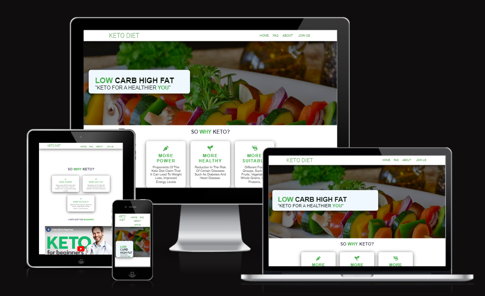
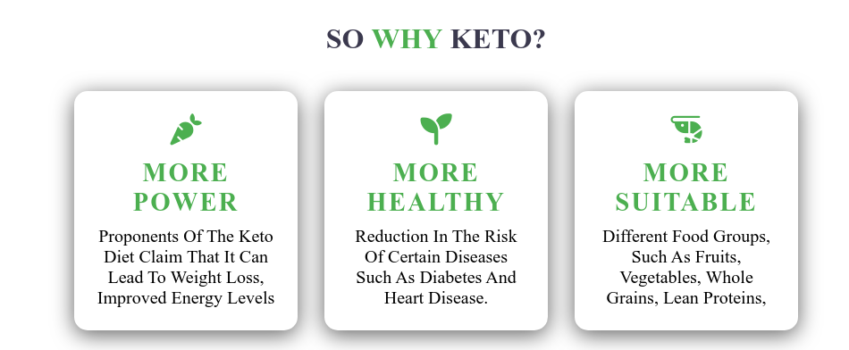

# THE KETO DITE

Welcome to the Keto Project! This website is dedicated to providing information and resources for anyone interested in the ketogenic diet.

## Purpose For This Project:
The purpose of this website is to educate visitors about the ketogenic diet and provide helpful resources for starting and maintaining a ketogenic lifestyle. The website covers topics such as what the ketogenic diet is, how it works, and its potential health benefits.
## Features:
- __Navigation Bar__

  - The navbar is available on all pages of the website and includes the following links:

Home: Takes the user back to the home page.

FAQ: Takes the user to a page with frequently asked questions and answers.

About: Takes the user to a page with information about The team and the Mission .

Sign Up: Takes the user to a page where they can fill a form  to receive a tailored meal plan based on  individual dietary needs and preferences
  

- __The landing page image__

  - The website's landing page showcases a captivating image with overlaid text that highlights the most significant aspect of the ketogenic diet

- __Ketogenic In particular__

  - The landing page's captivating animation serves as an introduction to the world of keto, capturing users' attention and sparking their curiosity.

- __intro video__

  - this content a video for  very beginners intro about ketogenic diet

- __The Footer__

  - The footer section includes links to the relevant social media sites for Keto diet. The links will open to a new tab to allow easy navigation for the user.
