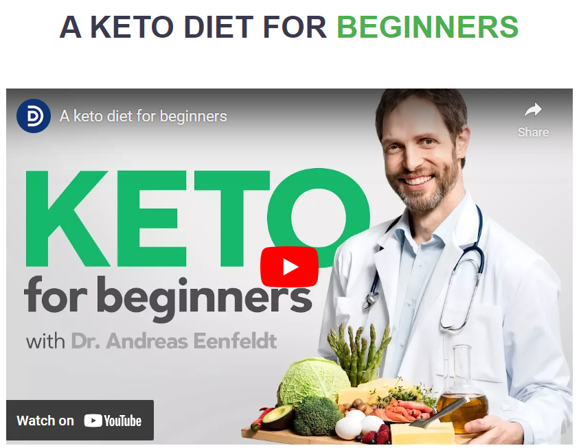
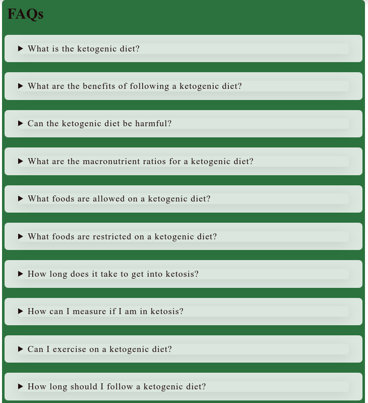

# THE KETO DITE

Welcome to the Keto Project! This website is dedicated to providing information and resources for anyone interested in the ketogenic diet.

## Purpose For This Project:
The purpose of this website is to educate visitors about the ketogenic diet and provide helpful resources for starting and maintaining a ketogenic lifestyle. The website covers topics such as what the ketogenic diet is, how it works, and its potential health benefits.
## Features:
- __Navigation Bar__

  - The navbar is available on all pages of the website and includes the following links:

    Home: Takes the user back to the home page.

    FAQ: Takes the user to a page with frequently asked questions and answers.

    About: Takes the user to a page with information about The team and the Mission .

    Sign Up: Takes the user to a page where they can fill a form  to receive a tailored meal plan based on  individual dietary needs and preferences
  

- __The landing page image__

  - The website's landing page showcases a captivating image with overlaid text that highlights the most significant aspect of the ketogenic diet

- __Ketogenic In particular__

  - The landing page's captivating animation serves as an introduction to the world of keto, capturing users' attention and sparking their curiosity.

- __intro video__

  - this content a video intro about beginners ketogenic diet

- __The Footer__

  - Our footer section includes links to our social media sites for Keto diet, which are designed to provide additional resources and support for our readers. The links are easily accessible and will open in a new tab, allowing for seamless navigation for the user. We're active on a variety of social media platforms, so be sure to follow us for updates, tips, and inspiration to help you achieve your health and wellness goals!

- __FAQ Page__

  - A FAQ section with answers to 10 common questions about the ketogenic diet

- __About and our team__

  - Our About page is where you can learn more about our content team and the mission and values that drive our work. You'll find a team photo and bios for each team member,  We believe in creating high-quality, informative content that helps our readers make informed decisions about their health and well-being. Check out our About page to learn more about who we are and what we do!

- __Sign page__

  - A sign-up form page where visitors can receive a customized plan for starting a ketogenic diet

## Testing 

### Validator Testing 

- HTML
  - No errors were returned when passing through the official [W3C validator](https://validator.w3.org/nu/?doc=https%3A%2F%2Fcode-institute-org.github.io%2Flove-running-2.0%2Findex.html)
- CSS
  - No errors were found when passing through the official [(Jigsaw) validator](https://jigsaw.w3.org/css-validator/validator?uri=https%3A%2F%2Fvalidator.w3.org%2Fnu%2F%3Fdoc%3Dhttps%253A%252F%252Fcode-institute-org.github.io%252Flove-running-2.0%252Findex.html&profile=css3svg&usermedium=all&warning=1&vextwarning=&lang=en#css)

## Deployment
 
- The site was deployed to GitHub pages. The steps to deploy are as follows: 
  - In the GitHub repository, navigate to the Settings tab 
  - From the source section drop-down menu, select the Master Branch
  - Once the master branch has been selected, the page will be automatically refreshed with a detailed ribbon display to indicate the successful deployment. 

The live link can be found here - https://wlia-code.github.io/Keto_Project/ 

## Credits 

### Content 

- All text in the website generated by [ChatGPT](https://chat.openai.com)
- The icons in the footer were taken from [Font.Awesome](https://fontawesome.com)
- All fonts using from [fonts.google](https://fonts.google.com)

### Media

- All photos used taken from [unsplash](https://unsplash.com/)
- The keto diet for beginners video from  [Diet Doctor](https://youtu.be/zrRDnLJdjmQ)

